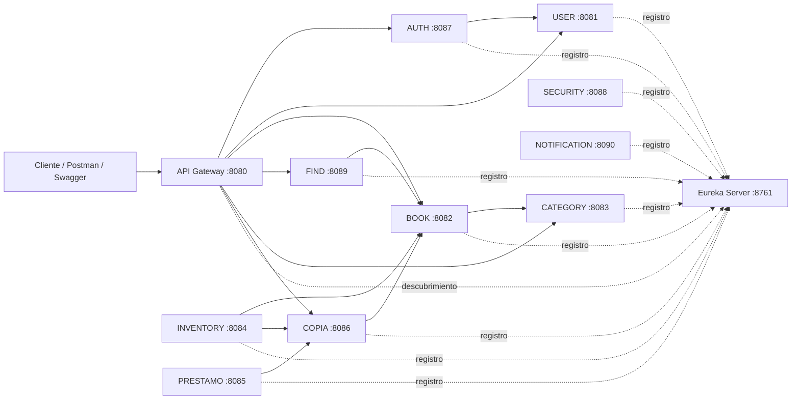

# Biblio — Plataforma de Biblioteca basada en Microservicios

## Enlaces oficiales de entrega

> **Importante:** antes de entregar, reemplace los cuatro marcadores siguientes por enlaces públicos y verifique el acceso desde una ventana de incógnito.

| Entregable | Enlace |
|---|---|
| **Versión nativa para Windows (.jar + `iniciar-biblio.bat`)** | [Descargar versión nativa](https://drive.google.com/file/d/1RbmXIRrfe7SmZ-QTusotVuaGay9d9wwq/view?usp=sharing) |
| **Versión Docker** | [Descargar versión Docker](ENLACE_VERSION_DOCKER_AQUI) |
| **Video de defensa** | [Ver video de defensa](https://drive.google.com/file/d/12SVj36zO4B9urk3hsWOi8dqu0VX1kgCw/view?usp=sharing) |
| **Subtítulos del video** | [Descargar `subtitulos-video.txt`](https://drive.google.com/file/d/1wqZQZsShtzfdv8SDlucq52Ngwe4uIM-h/view?usp=sharing) |

---

## Descripción

**Biblio** es una plataforma de gestión bibliotecaria construida con una arquitectura de microservicios. El sistema separa las responsabilidades de usuarios, autenticación, categorías, libros, copias, búsquedas, inventario, préstamos, seguridad y notificaciones. Los servicios se registran en **Eureka Server** y las rutas públicas configuradas se exponen mediante **Spring Cloud Gateway**.

El proyecto utiliza **Java 17**, **Spring Boot 3.5.14**, **Spring Cloud 2025.0.2**, **Maven**, **MySQL**, **Spring Data JPA**, **Spring Security**, **JWT**, **OpenFeign**, **Swagger/OpenAPI**, **JUnit 5**, **Mockito** y **JaCoCo**.

## Índice

- [Arquitectura](#arquitectura)
- [Servicios y puertos](#servicios-y-puertos)
- [Requisitos](#requisitos)
- [Compilación y pruebas](#compilación-y-pruebas)
- [Ejecución nativa con el script BAT](#ejecución-nativa-con-el-script-bat)
- [Ejecución manual](#ejecución-manual)
- [Versión Docker](#versión-docker)
- [API Gateway](#api-gateway)
- [Swagger y OpenAPI](#swagger-y-openapi)
- [Pruebas y cobertura](#pruebas-y-cobertura)
- [Video de defensa](#video-de-defensa)
- [Estructura del repositorio](#estructura-del-repositorio)

## Arquitectura



### Orden jerárquico de inicio

1. **Eureka Server**.
2. **Microservicios**, respetando sus dependencias internas:
   - Base: `user-service`, `category-service`, `security-service` y `notification-service`.
   - Luego: `auth-service` y `book-service`.
   - Luego: `copia-service` y `find-service`.
   - Finalmente: `inventory-service` y `prestamo-service`.
3. **API Gateway**.

Este orden está automatizado en el archivo `iniciar-biblio.bat`.

## Servicios y puertos

| Componente | Puerto | Responsabilidad principal | Base de datos |
|---|---:|---|---|
| Eureka Server | `8761` | Registro y descubrimiento de servicios | No aplica |
| API Gateway | `8080` | Punto de entrada y enrutamiento | No aplica |
| User Service | `8081` | Gestión de usuarios | `user_db` |
| Book Service | `8082` | Gestión de libros | `library_books` |
| Category Service | `8083` | Gestión de categorías | `category_db` |
| Inventory Service | `8084` | Movimientos y resumen de inventario | `library_inventory` |
| Préstamo Service | `8085` | Gestión de préstamos y devoluciones | `prestamo_db` |
| Copia Service | `8086` | Gestión de ejemplares o copias | `library_copias` |
| Auth Service | `8087` | Registro, inicio de sesión y emisión de JWT | `auth_db` |
| Security Service | `8088` | Registro de eventos de seguridad | `security_db` |
| Find Service | `8089` | Búsqueda agregada de libros | No aplica |
| Notification Service | `8090` | Gestión de notificaciones | `notification_db` |

## Requisitos

### Ejecución nativa

- Windows 10 u 11.
- **JDK 17** configurado en `PATH`.
- **Apache Maven 3.9 o superior** para ejecutar el agregador raíz.
- MySQL 8.x o MariaDB compatible.
- Puerto MySQL disponible. El script está configurado inicialmente para `3307`.
- Puertos `8080` a `8090` y `8761` disponibles.

Compruebe las herramientas instaladas:

```powershell
java -version
mvn -version
```

### Configuración de MySQL

Abra `iniciar-biblio.bat` y ajuste estas variables según su entorno:

```bat
set "MYSQL_HOST=localhost"
set "MYSQL_PORT=3307"
set "MYSQL_USER=root"
set "MYSQL_PASSWORD="
```

El script envía a cada servicio su URL de conexión y agrega `createDatabaseIfNotExist=true`. El usuario configurado debe tener permisos para crear y modificar bases de datos.

## Compilación y pruebas

El archivo `pom.xml` ubicado en la raíz funciona como **agregador Maven multi-módulo**. Desde la carpeta raíz del proyecto ejecute:

```powershell
mvn clean install
```

Este comando:

1. limpia compilaciones anteriores;
2. compila todos los módulos;
3. ejecuta la suite de pruebas con **JUnit 5 y Mockito**;
4. valida las reglas de cobertura configuradas con **JaCoCo**;
5. genera los archivos `.jar` dentro de la carpeta `target` de cada servicio.

Para ejecutar una verificación completa sin instalar los artefactos en el repositorio local:

```powershell
mvn clean verify
```

Para omitir temporalmente las pruebas durante una compilación de diagnóstico:

```powershell
mvn clean install -DskipTests
```

> La entrega final debe validarse sin `-DskipTests`.

## Ejecución nativa con el script BAT

### Paso 1: compilar el sistema

Desde la raíz:

```powershell
mvn clean install
```

### Paso 2: configurar MySQL

Edite las variables iniciales de `iniciar-biblio.bat` y guarde el archivo.

### Paso 3: iniciar todo el sistema

Puede hacer doble clic sobre:

```text
iniciar-biblio.bat
```

También puede ejecutarlo desde PowerShell:

```powershell
.\iniciar-biblio.bat
```

El script realiza automáticamente la secuencia requerida:

1. inicia Eureka Server;
2. espera que el registro esté disponible;
3. inicia los microservicios por grupos de dependencia;
4. inicia API Gateway al final;
5. informa las direcciones principales de comprobación.

### Paso 4: comprobar el estado

- Eureka Dashboard: `http://localhost:8761`
- API Gateway: `http://localhost:8080`

En Eureka, los servicios iniciados deben aparecer con estado **UP**.

## Ejecución manual

La ejecución manual debe respetar el mismo orden jerárquico. Ejemplo para Eureka:

```powershell
java -jar .\eureka-server\eureka-server\target\eureka-server-0.0.1-SNAPSHOT.jar
```

Ejemplo para User Service:

```powershell
java -jar .\user-service\user-service\target\user-service-0.0.1-SNAPSHOT.jar
```

Ejemplo para API Gateway, que debe iniciarse al final:

```powershell
java -jar .\api-gateway\api-gateway\target\api-gateway-0.0.1-SNAPSHOT.jar
```

Para una puesta en marcha completa se recomienda utilizar `iniciar-biblio.bat`, porque aplica esperas y conserva el orden correcto.

## Versión Docker

La versión Docker debe descargarse desde el enlace ubicado al principio del documento. Dentro de esa distribución, ejecute:

```powershell
docker compose up --build
```

Para detener y eliminar los contenedores:

```powershell
docker compose down
```

Para eliminar además los volúmenes persistentes:

```powershell
docker compose down -v
```

Validaciones mínimas de la versión Docker:

```powershell
docker compose ps
docker compose logs -f
```

Después del inicio, compruebe Eureka en `http://localhost:8761` y el Gateway en `http://localhost:8080`.

## API Gateway

Las rutas actualmente configuradas en `api-gateway` son:

| Ruta pública | Servicio de destino |
|---|---|
| `/auth/**` | `AUTH-SERVICE` |
| `/users/**` | `USER-SERVICE` |
| `/books/**` | `BOOK-SERVICE` |
| `/find/**` | `FIND-SERVICE` |
| `/categories/**` | `CATEGORY-SERVICE` |
| `/copias/**` | `COPIA-SERVICE` |

Ejemplos:

```text
POST http://localhost:8080/auth/register
POST http://localhost:8080/auth/login
GET  http://localhost:8080/books
GET  http://localhost:8080/find/books
GET  http://localhost:8080/categories
GET  http://localhost:8080/copias
```

Los endpoints protegidos requieren:

```http
Authorization: Bearer <TOKEN_JWT>
```

`inventory-service`, `prestamo-service`, `security-service` y `notification-service` se consultan directamente por sus puertos mientras no se agreguen rutas específicas al Gateway.

## Swagger y OpenAPI

Los microservicios de negocio incluyen documentación interactiva mediante **Springdoc OpenAPI y Swagger UI**.

| Servicio | Swagger UI |
|---|---|
| User | `http://localhost:8081/swagger-ui.html` |
| Book | `http://localhost:8082/swagger-ui.html` |
| Category | `http://localhost:8083/swagger-ui.html` |
| Inventory | `http://localhost:8084/swagger-ui.html` |
| Préstamo | `http://localhost:8085/swagger-ui.html` |
| Copia | `http://localhost:8086/swagger-ui.html` |
| Auth | `http://localhost:8087/swagger-ui.html` |
| Security | `http://localhost:8088/swagger-ui.html` |
| Find | `http://localhost:8089/swagger-ui.html` |
| Notification | `http://localhost:8090/swagger-ui.html` |

La especificación OpenAPI está disponible normalmente en:

```text
http://localhost:<PUERTO>/v3/api-docs
```

Para probar endpoints protegidos desde Swagger:

1. inicie sesión mediante `POST /auth/login`;
2. copie el JWT recibido;
3. pulse **Authorize**;
4. ingrese `Bearer <TOKEN_JWT>` si la interfaz solicita el prefijo.

## Pruebas y cobertura

El proyecto contiene pruebas unitarias y de capa web construidas con **JUnit 5**, **Mockito**, Spring Boot Test y Spring Security Test.

En el ZIP analizado se detectaron **65 clases de prueba**, distribuidas de esta forma:

| Módulo | Clases de prueba detectadas |
|---|---:|
| Auth Service | 10 |
| Book Service | 7 |
| Category Service | 9 |
| Copia Service | 5 |
| Find Service | 5 |
| Inventory Service | 5 |
| Notification Service | 6 |
| Préstamo Service | 4 |
| Security Service | 6 |
| User Service | 8 |
| API Gateway | 0 |
| Eureka Server | 0 |

Los diez microservicios de negocio tienen configurado **JaCoCo** con un mínimo de cobertura del **80 %**. Según el servicio, la validación combina cobertura de instrucciones con cobertura de ramas o líneas.

Ejecutar todas las pruebas y verificaciones:

```powershell
mvn clean verify
```

Los reportes JaCoCo de cada servicio se generan normalmente en:

```text
<servicio>/target/site/jacoco/index.html
```

## Video de defensa

El video de defensa debe cumplir estas condiciones:

- duración ideal: **15 minutos**;
- duración máxima: **18 minutos**;
- mostrar la arquitectura y estructura del repositorio;
- demostrar la compilación, las pruebas y los JAR;
- mostrar Eureka con los servicios en estado `UP`;
- demostrar API Gateway, autenticación JWT y endpoints principales;
- mostrar Swagger/OpenAPI;
- demostrar la versión Docker;
- incluir subtítulos incrustados o entregar el archivo `subtitulos-video.txt`.

El enlace del video y el enlace de los subtítulos deben permanecer al principio de este README para que el evaluador pueda acceder a ellos inmediatamente.

## Estructura del repositorio

```text
Biblio-main/
├── pom.xml
├── README.md
├── iniciar-biblio.bat
├── eureka-server/
│   └── eureka-server/
├── api-gateway/
│   └── api-gateway/
├── user-service/
│   └── user-service/
├── auth-service/
│   └── auth-service/
├── category-service/
│   └── category-service/
├── book-service/
│   └── book-service/
├── copia-service/
│   └── copia-service/
├── find-service/
│   └── find-service/
├── inventory-service/
│   └── inventory-service/
├── prestamo-service/
│   └── prestamo-service/
├── security-service/
│   └── security-service/
└── notification-service/
    └── notification-service/
```

## Lista de comprobación antes de entregar

- [ ] Los cuatro enlaces del comienzo fueron reemplazados por enlaces públicos reales.
- [ ] La versión nativa contiene todos los `.jar` y `iniciar-biblio.bat`.
- [ ] La versión Docker contiene sus Dockerfiles y `docker-compose.yml` o `compose.yml`.
- [ ] `mvn clean install` finaliza correctamente sin omitir pruebas.
- [ ] `mvn clean verify` aprueba las reglas de JaCoCo.
- [ ] Eureka muestra los servicios requeridos con estado `UP`.
- [ ] API Gateway responde en el puerto `8080`.
- [ ] Swagger UI abre en los microservicios documentados.
- [ ] El video dura como máximo 18 minutos.
- [ ] El video incluye subtítulos o se entregó `subtitulos-video.txt`.
- [ ] Los enlaces fueron probados sin iniciar sesión en la cuenta del propietario.
